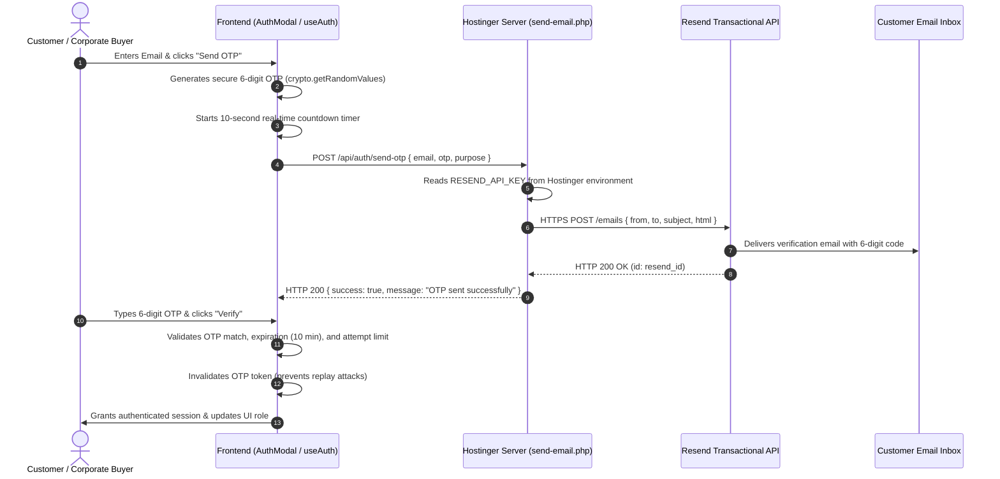
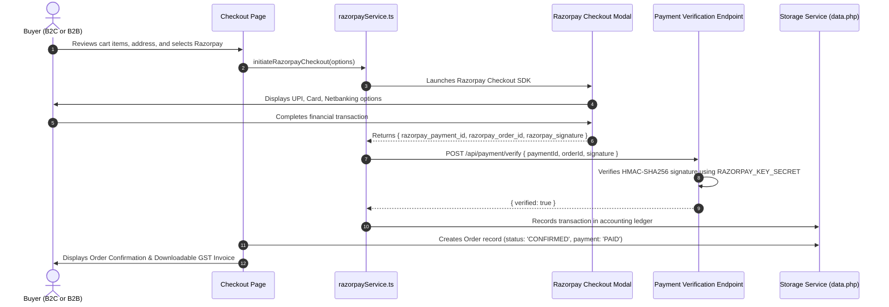
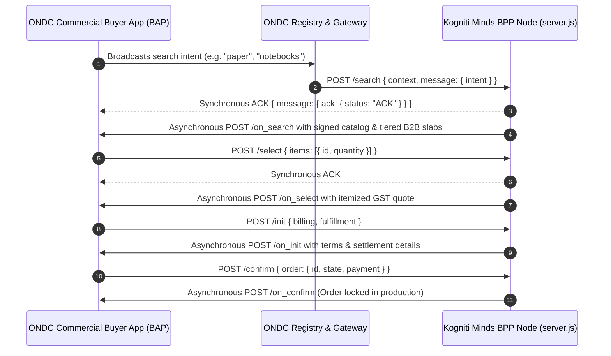

# Kogniti Minds - System Architecture & Technical Specification

This document provides the full architectural blueprint of the **Kogniti Minds** digital commerce and ONDC platform.

---

## 1. High-Level System Architecture

```mermaid
graph TB
    subgraph Client Tier (Browser)
        UI[React 18 Single Page Application]
        AuthCtx[AuthContext - Role & State Management]
        CartCtx[CartContext - Pricing & Tax Calculation]
        LocalStorage[(Browser LocalStorage Cache)]
        UI <--> AuthCtx
        UI <--> CartCtx
        AuthCtx <--> LocalStorage
        CartCtx <--> LocalStorage
    end

    subgraph Hostinger Production Server (LiteSpeed / Apache)
        Apache[Apache / LiteSpeed Web Server]
        PHPHealth[api/health.php - Health Endpoint]
        PHPEmail[api/send-email.php - Transactional Dispatcher]
        PHPData[api/data.php - Persistence Engine]
        JSONStore[(data/storage/*.json - Atomic Store)]
        
        Apache -->|GET /api/health| PHPHealth
        Apache -->|POST /api/auth/send-otp| PHPEmail
        Apache -->|GET/POST /api/data/*| PHPData
        PHPData <--> JSONStore
    end

    subgraph External Infrastructure
        Resend[Resend Transactional API]
        Razorpay[Razorpay Payment Gateway]
        ONDCNetwork[Government of India ONDC B2B Network]
    end

    subgraph ONDC Daemon (Node.js Express on Port 3000)
        Express[server.js - Express 5 Application]
        ONDCRouter[server/ondc/ondcRouter.js]
        Crypto[server/ondc/crypto.js - Ed25519 Signatures]
        Mapper[server/ondc/catalogMapper.js]
        
        Apache -.->|Reverse Proxy ondc routes| Express
        Express --> ONDCRouter
        ONDCRouter <--> Crypto
        ONDCRouter <--> Mapper
    end

    PHPEmail -->|HTTPS + Server Key| Resend
    UI -->|Client SDK| Razorpay
    ONDCRouter <-->|Beckn Protocol Callbacks| ONDCNetwork
```

---

## 2. Authentication & OTP Verification Flow



---

## 3. Order & Payment Processing Flow



---

## 4. ONDC B2B Buyer-Seller Flow


