# Kogniti Minds - Production Deployment Guide

This guide details the complete deployment lifecycle, web server architecture, CI/CD pipeline, and server configuration for **Kogniti Minds Private Limited** (`https://kognitiminds.com`).

---

## 1. Production Architecture Overview

The production environment runs on **Hostinger Cloud / Web Hosting** powered by **LiteSpeed Web Server (LSWS)** with native **PHP 8.3** support and a **Node.js (Express 5)** daemon for ONDC network protocol handling.

```
                  ┌─────────────────────────────────────────┐
                  │          Internet / Visitors            │
                  └────────────────────┬────────────────────┘
                                       │ HTTPS (443)
                                       ▼
                  ┌─────────────────────────────────────────┐
                  │    LiteSpeed Web Server (.htaccess)     │
                  └─────────┬──────────────┬──────────────┬─┘
                            │              │              │
     Static Assets          │              │ Direct PHP   │ ONDC Reverse Proxy
     (Vite React SPA)       │              │ Execution    │ (Optional / Local)
            ▼               │              ▼              │          ▼
 ┌──────────────────────┐   │   ┌────────────────────┐   │ ┌────────────────────┐
 │  public_html/        │   │   │ public_html/api/   │   │ │ localhost:3000     │
 │  ├── index.html      │   │   │ ├── send-email.php │   │ │ (Express 5 Node)   │
 │  ├── assets/ (.js)   │   │   │ ├── health.php     │   │ │ ├── /search        │
 │  └── assets/ (.css)  │   │   │ └── data.php       │   │ │ ├── /select        │
 └──────────────────────┘   │   └─────────┬──────────┘   │ │ ├── /init          │
                            │             │ Reads/Writes │ │ └── /confirm       │
                            │             ▼              │ └────────────────────┘
                            │   ┌────────────────────┐   │
                            │   │ data/storage/      │   │
                            │   │ ├── orders.json    │   │
                            │   │ ├── rfqs.json      │   │
                            │   │ └── *.json         │   │
                            └─► └────────────────────┘ ◄─┘
```

### Why Native PHP Endpoints are Used for Critical APIs
1. **Zero Proxy Latency**: Requests to `/api/send-email.php` and `/api/health.php` execute within **15–25ms** without going through Apache/LiteSpeed reverse proxy layers (`mod_proxy`), eliminating HTTP 503 Gateway/Connection errors.
2. **High Concurrency**: LiteSpeed PHP LSAPI processes each request in isolated memory with keep-alive pooling.
3. **No Process Termination Failures**: Unlike Node.js processes that can crash or be killed during shared/cPanel memory spikes, PHP runs on-demand per request.

---

## 2. Automated Git CI/CD Deployment

The repository is integrated with Hostinger Git Deployment. Any commit pushed to `origin main` automatically builds and deploys to the live server.

### The CI/CD Pipeline

```mermaid
graph LR
    Dev[Developer / AI Agent] -->|npm run build| Build[Vite Production Bundle]
    Build -->|npm run test:ondc| Test[51 ONDC Protocol Tests]
    Test -->|git push origin main| GitHub[GitHub: origin/main]
    GitHub -->|Hostinger Webhook| Hostinger[Hostinger Git CI/CD]
    Hostinger -->|Pull & Deploy| Live[Live: kognitiminds.com]
```


### Mandatory Pre-Push Verification Checklist
Before executing `git push origin main`, always run the following sequence:

```bash
# 1. Verify TypeScript and Vite production bundle compiles cleanly
npm run build

# 2. Run the 51-point ONDC protocol test suite
npm run test:ondc

# 3. Check git status to ensure no secret files (.env, credentials) are staged
git status

# 4. Commit with descriptive message
git commit -m "feat(module): descriptive explanation of change"

# 5. Push to origin main
git push origin main
```

> [!IMPORTANT]
> Hostinger immediately pulls new commits from `main`. Never push code that breaks `npm run build` or fails ONDC protocol tests.

---

## 3. Server `.htaccess` Configuration

The root `.htaccess` file controls rewrite routing, security headers, asset caching, and file access controls:

```apache
# --- Browser Caching for Performance ---
<IfModule mod_expires.c>
  ExpiresActive On
  ExpiresDefault "access plus 1 month"
  ExpiresByType text/html "access plus 0 seconds"
  ExpiresByType text/css "access plus 1 year"
  ExpiresByType application/javascript "access plus 1 year"
  ExpiresByType image/jpeg "access plus 1 year"
  ExpiresByType image/png "access plus 1 year"
  ExpiresByType image/svg+xml "access plus 1 year"
  ExpiresByType image/webp "access plus 1 year"
</IfModule>

# --- Security Headers ---
<IfModule mod_headers.c>
  Header always set X-Content-Type-Options "nosniff"
  Header always set X-Frame-Options "SAMEORIGIN"
  Header always set X-XSS-Protection "1; mode=block"
  Header always set Referrer-Policy "strict-origin-when-cross-origin"
</IfModule>

# --- Protect Sensitive Files and Data Storage ---
<FilesMatch "^\.env|composer\.(json|lock)|package(-lock)?\.json">
  Order allow,deny
  Deny from all
</FilesMatch>

<Directory "/home/u*/public_html/data/storage">
  Order allow,deny
  Deny from all
</Directory>

# --- URL Routing ---
<IfModule mod_rewrite.c>
  RewriteEngine On
  RewriteBase /

  # HTTPS Enforcement
  RewriteCond %{HTTPS} off
  RewriteRule ^(.*)$ https://%{HTTP_HOST}%{REQUEST_URI} [L,R=301]

  # Direct PHP API bypass - DO NOT route through index.html
  RewriteRule ^api/.*\.php$ - [L]

  # Static files bypass
  RewriteCond %{REQUEST_FILENAME} -f [OR]
  RewriteCond %{REQUEST_FILENAME} -d
  RewriteRule ^ - [L]

  # Single Page Application (SPA) fallback
  RewriteRule ^ index.html [L]
</IfModule>
```

---

## 4. Production Environment Variables (`.env`)

Production environment variables must be created directly on the Hostinger server or root workspace.

### Production Variable Reference

| Variable | Location | Purpose | Required For |
|---|---|---|---|
| `VITE_RESEND_API_KEY` | Client & Server `.env` | Resend email dispatch key (`re_...`) | Email OTP delivery |
| `RESEND_API_KEY` | Server Environment | Resend API key for PHP/Node backends | Server-side email API |
| `VITE_RAZORPAY_KEY_ID` | Client `.env` | Razorpay Merchant Public Key (`rzp_...`) | Checkout modal popup |
| `RAZORPAY_KEY_SECRET` | Server `.env` | Razorpay API Secret | Server-side signature verification |
| `PORT` | Server `.env` | Node.js Express server port (default `3000`) | ONDC daemon |
| `NODE_ENV` | Server `.env` | Environment flag (`production`) | Logging and optimizations |

### How PHP Loads Environment Variables on Hostinger
The PHP backend in `public/api/send-email.php` checks for keys in three tiered locations:
1. `getenv('RESEND_API_KEY')` / `$_ENV['RESEND_API_KEY']` (Web server environment)
2. `public/.env` or root `.env` parsed directly by the PHP script
3. Client-provided `Authorization: Bearer <token>` header (as a secure fallback)

---

## 5. Storage Directory Permissions

The server-side atomic JSON database operates in `data/storage/`. Ensure appropriate permissions:

```bash
# Data directory permissions on Linux/Hostinger
chmod 755 data/
chmod 755 data/storage/
chmod 644 data/storage/*.json
```

All writes use `LOCK_EX` atomic file locks with temporary swap files to prevent file corruption during concurrent operations.

---

## 6. ONDC Express Daemon Deployment

For ONDC B2B network integration, the Express server handles the 11 protocol endpoints:

```bash
# Start ONDC daemon in production using PM2
pm2 start server.js --name "kogniti-ondc" --time

# Verify ONDC status
pm2 status kogniti-ondc
pm2 logs kogniti-ondc --lines 50

# Restart daemon after updates
pm2 restart kogniti-ondc
```

### Protocol Health Verification
```bash
curl -i https://kognitiminds.com/health
# Expected: HTTP/2 200 OK {"status":"UP","service":"Kogniti Minds ONDC B2B Engine",...}
```

---

## 7. Rollback Procedure

In the unlikely event of an unexpected production regression:

1. Identify the previous stable Git commit:
   ```bash
   git log --oneline -n 5
   ```
2. Revert the commit or checkout the stable commit tag:
   ```bash
   git revert HEAD
   npm run build
   npm run test:ondc
   git push origin main
   ```
3. Hostinger CI/CD will immediately deploy the reverted stable build within 60 seconds.
