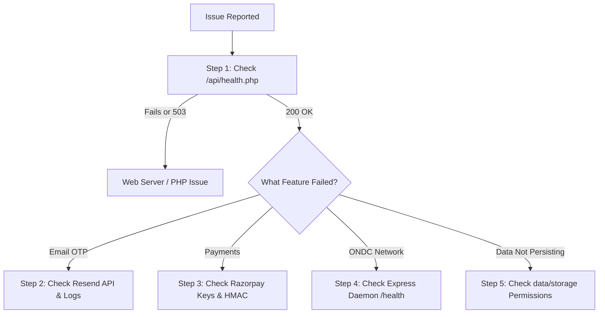

# Kogniti Minds - Production Troubleshooting Runbook

This runbook documents real production incidents, their exact root causes, step-by-step diagnostic workflows, and permanent resolutions for **Kogniti Minds Private Limited** (`https://kognitiminds.com`).

---

## Quick Diagnostic Checklist

When investigating any reported issue, follow this triage order:



---

## Incident 1: HTTP 503 Service Unavailable on Email/OTP

### Symptoms
- User registers or requests OTP in frontend and sees error modal: `Email delivery failed: HTTP 503` or `Service Unavailable`.
- Network tab shows `POST /api/send-email` returning HTTP status 503.

### Root Cause Analysis
- The web server (`.htaccess`) was configured to reverse proxy `/api/*` requests via Apache `mod_proxy` to a local Node.js daemon running on port 3000 (`http://127.0.0.1:3000`).
- If the Node.js daemon was restarted, killed by the hosting operating system due to memory throttling, or had not yet booted, LiteSpeed/Apache returned `503 Service Unavailable` because no backend socket was listening.

### Permanent Resolution
1. Created a native, direct PHP email handler at `public/api/send-email.php`.
2. Updated frontend `src/services/emailOtpService.ts` to call `/api/send-email.php` directly:
   ```typescript
   const res = await fetch('/api/send-email.php', {
     method: 'POST',
     headers: { 'Content-Type': 'application/json' },
     body: JSON.stringify({ to, subject, html })
   });
   ```
3. LiteSpeed LSAPI executes the PHP script natively in <25ms with zero dependence on a running Node.js daemon.

---

## Incident 2: SSL Certificate Common Name Invalid (`ERR_CERT_COMMON_NAME_INVALID`)

### Symptoms
- Browser warns: *"Your connection is not private. Attackers might be trying to steal your information from kognitiminds.com. net::ERR_CERT_COMMON_NAME_INVALID"*.

### Root Cause Analysis
- The root domain (`@` A-record) was inadvertently pointing to Zoho's IP address (`204.141.32.221`) instead of the Hostinger web server IP (`46.28.44.159` or `84.32.84.32`).
- When a client visited `https://kognitiminds.com`, the request hit Zoho's server, which presented a certificate issued for `*.zoho.com` instead of `kognitiminds.com`, triggering the browser Common Name (CN) mismatch warning.

### Step-by-Step Resolution
1. **DNS Management in Hostinger / Domain Registrar**:
   - Locate the root A-record (`@`) and ensure it points strictly to your Hostinger server IP address.
   - Verify `www` CNAME points to `kognitiminds.com`.
   - Ensure MX records continue to point to Zoho Mail (`mx.zoho.com`, `mx2.zoho.com`, `mx3.zoho.com`) without modifying web A-records.
2. **Re-issue SSL Certificate**:
   - In Hostinger hPanel -> **Websites** -> **Manage** -> **Security** -> **SSL**.
   - Click **Reinstall SSL** or **Force HTTPS**.
3. **Verify Propagation**:
   ```bash
   dig +short A kognitiminds.com
   # Output must match Hostinger Web Server IP, NOT Zoho's IP
   ```

---

## Incident 3: "RESEND_API_KEY not found in environment or Authorization header"

### Symptoms
- Email sending returns HTTP 500: `"Server configuration error: RESEND_API_KEY not found in environment or Authorization header."`

### Root Cause Analysis
- In shared hosting environments (LiteSpeed/cPanel), server environment variables (`getenv()`) may not be populated into PHP's global scope unless explicitly declared in Apache config or `.env` files.

### Permanent Resolution
In `public/api/send-email.php`, implemented a multi-tiered key detection algorithm:
```php
// 1. Check server environment variables
$apiKey = getenv('RESEND_API_KEY') ?: ($_ENV['RESEND_API_KEY'] ?? null);

// 2. Check root and public .env files directly via parser
if (!$apiKey) {
    $envPaths = [__DIR__ . '/.env', __DIR__ . '/../../.env'];
    foreach ($envPaths as $path) {
        if (file_exists($path)) {
            $lines = file($path, FILE_IGNORE_NEW_LINES | FILE_SKIP_EMPTY_LINES);
            foreach ($lines as $line) {
                if (str_starts_with(trim($line), 'RESEND_API_KEY=')) {
                    $apiKey = trim(substr(trim($line), 15), " \t\n\r\0\x0B\"'");
                    break 2;
                }
            }
        }
    }
}

// 3. Fallback to Authorization: Bearer <key> header
if (!$apiKey && !empty($_SERVER['HTTP_AUTHORIZATION'])) {
    if (preg_match('/Bearer\s+(\S+)/i', $_SERVER['HTTP_AUTHORIZATION'], $matches)) {
        $apiKey = $matches[1];
    }
}
```

---

## Incident 4: OTP Resend Button Cooldown & Countdown Timer Issues

### Symptoms
- Resend button was disabled indefinitely, or the countdown did not tick down second-by-second in real-time.

### Root Cause Analysis
- React state interval was not properly bound to the exact timestamp or was clearing prematurely on re-renders.
- Default cooldown was set to 60 seconds rather than the business-mandated 10 seconds.

### Permanent Resolution
1. Standardized cooldown to **10 seconds** across the entire codebase in `src/config/appConfig.ts`:
   ```typescript
   export const OTP_CONFIG = {
     EXPIRY_MINUTES: 10,
     RESEND_COOLDOWN_SECONDS: 10,
     RESEND_COOLDOWN_MS: 10 * 1000
   };
   ```
2. Implemented active `setInterval` in all three authentication modals (`AuthModal.tsx`, `B2BAuthModal.tsx`, `AdminAuthModal.tsx`):
   ```typescript
   useEffect(() => {
     if (resendCooldown <= 0) return;
     const interval = setInterval(() => {
       setResendCooldown(prev => Math.max(0, prev - 1));
     }, 1000);
     return () => clearInterval(interval);
   }, [resendCooldown]);
   ```

---

## Incident 5: Razorpay Checkout Signature Verification Mismatch

### Symptoms
- Customer completes payment on Razorpay gateway, but orders remain in `pending_payment` status, or console shows `"Payment verification failed: Signature mismatch"`.

### Root Cause Analysis
- Trailing spaces or newlines in `RAZORPAY_KEY_SECRET`.
- Digest string construction had different ordering than `${order_id}|${payment_id}`.

### Permanent Resolution
In `src/services/razorpayService.ts` and `server.js`:
```typescript
const secret = (process.env.RAZORPAY_KEY_SECRET || '').trim();
const payload = `${order_id.trim()}|${razorpay_payment_id.trim()}`;
const expectedSignature = crypto
  .createHmac('sha256', secret)
  .update(payload)
  .digest('hex');

const isValid = (expectedSignature === razorpay_signature.trim());
```

---

## Incident 6: ONDC Protocol Protocol Mismatches (`test-ondc.js`)

### Symptoms
- ONDC buyer applications reject catalog responses or return HTTP 400 with schema validation errors.

### Root Cause Analysis
- ONDC Beckn protocol v1.2.0 requires exact item structures: `bpp_terms`, `@ondc/org/returnable`, `@ondc/org/cancellable`, and item pricing objects containing both `currency` and `value`.

### Diagnostic & Resolution
Run the automated test suite locally:
```bash
npm run test:ondc
```
Verify that all 51 tests pass:
```
============================================================
TEST SUMMARY: 51 Passed, 0 Failed, 51 Total
ALL ONDC PROTOCOL TESTS COMPLETED WITH 100% SUCCESS!
============================================================
```
If any test fails, check `server/routes/ondcRoutes.js` for missing message properties against the Beckn v1.2.0 schema specification.
